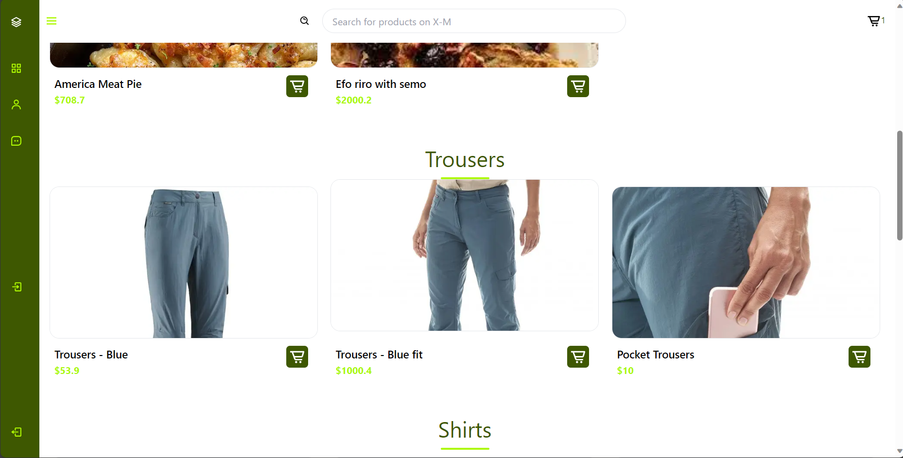

# X Merchandise With Framework

This is a modern store with cool navigation features and Cart features, Total is auto calculated and Sum total of cart products is auto calculated.

## Previews

### Home




### Dashboard


### Store


### Auth Pages


### Cart Page


## Technologies Used

- TypeScript
- React for the frontend
- Next 14
- TailWind CSS
- React Icons

## Getting Started

1 **Clone the Repository:**

```bash
   git clone https://github.com/nnoromiv/xMerchandise.git
```

2 **Install Dependencies:**

```bash
    npm install
```

3 Run the Application:

```bash
    npm run dev
```

## Access the Application

Open your browser and go to http://localhost:3000 to access the store.

## Contributing

Feel free to contribute to the project by opening issues or submitting pull requests. Your feedback and suggestions are highly appreciated.

## License

This project is licensed under the MIT License - see the LICENSE file for details.
